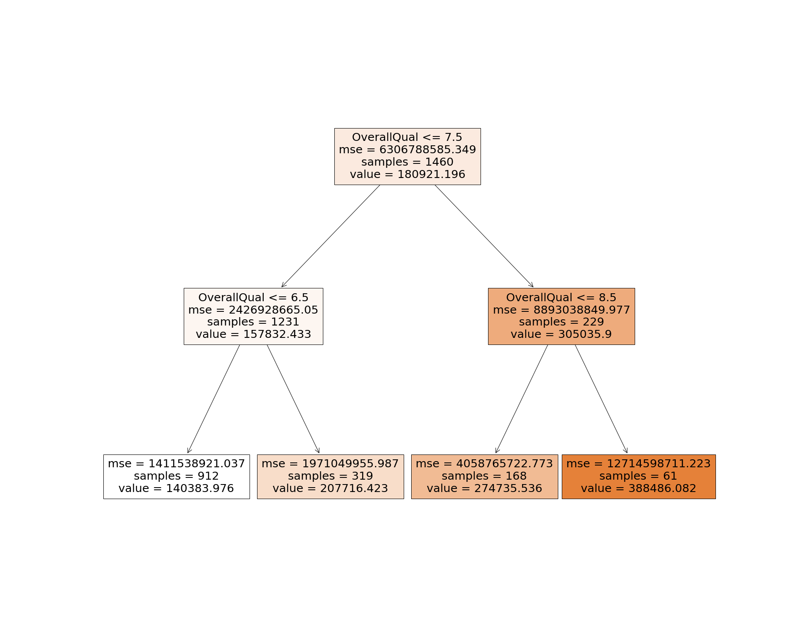
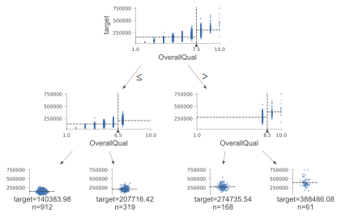
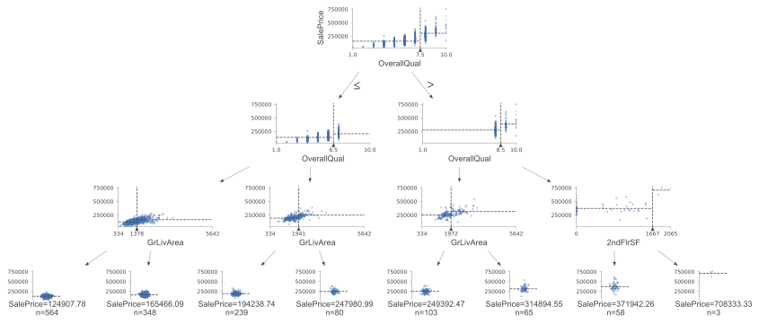
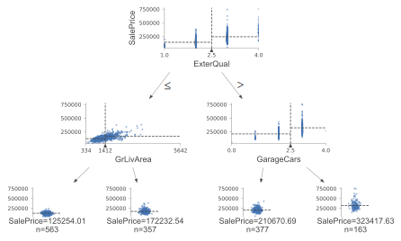
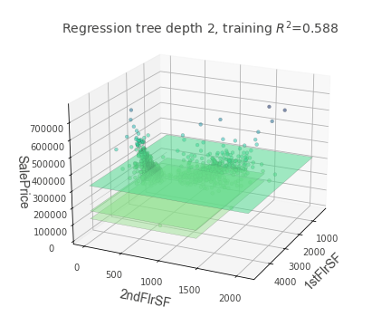
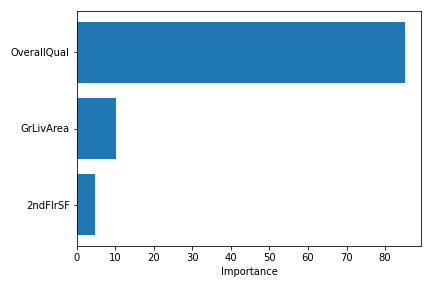

# Decision Trees

We begin by asking the question: what makes a house expensive? Our prior belief based on intuition is that the larger the size of the property, the more expensive it should be. Models can help explain data with a large number of features, like we have in the Ames houseprice dataset. However, we require a way of interpreting this model. 

Decision trees are some of the most interpretable models available. They work by repeatedly 'slicing' data into subsets according to some threshold value in the features. The tree expands its depth through creating 2 new nodes representing a binary decision. For example, the feature `LotArea` could be arbitrarily split at the threshold `50.5` so that `LotArea <= 50.5` belongs to one subset and `LotArea > 50.5` belongs to another. In reality, the threshold is chosen to minimise the variance of our target feature `SalePrice`. This is because minimising target variance gives subsets that are maximally different with respect to the target, which can then be used to select features which would create the best partition of data. 

Our first decision tree has a maximum depth of 2 to keep interpretation simple. The following figure is a decision tree with each node representing a split point. The feature `OverallQual` is repeatedly used by the model to split the data which tells us this is the most discerning feature. `mse` is the mean squared error which can be used for model comparison. `samples` tell us the size of the subset. In this case, the root node shows `samples=1460` which is the number of rows in our training set. `value` is the split point in terms of target `SalePrice`. In the root node, `value=180921.196` coincides with mean `SalePrice` of training set which is `180921.195890`.

A more visual way to interpret the above would be through the figure below. The vertical axis `target` represents `SalePrice`. At this point, we note that due to extremely small `max_depth`, the visualisation only tells us that `OverallQual` is the most important feature to decide on the final value of a house. A tree with greater depth split by different features will be more insightful to us.

Using `max_depth=3` reveals ground living area, `GrLivArea`, is the next most discerning feature along with 2nd floor living area, `2ndFlrSF`. We note both these features correspond to size of property. Also note that with the exception of `OverallQual`, the fact that our model uses features which measure size of house to 'understand' property pricing corresponds with human intuition.

The feature `OverallQual` is very specific to our particular dataset and we assume our tree uses this to split near the root as it must highly correlate with house price. However, it may be interesting to explore other features our houses which impacts its valuation.

`ExterQual` refers to the quality of the material on the exterior of the house. It takes the form of a Likert scale, ranging from 1-5 (poor to excellent). Our decision tree makes a split where property value remains the closest (minimising target variance). Horizontal dotted lines are showing mean target values for each subset. The leaves in this tree show datapoints in the subset obtained by following the boolean logic of the tree branches. The horizontal dotted line here represents prediction value.

We now look at how the tree partitions 1st floor and 2nd floor size of property with respect to `SalePrice`.

Analysing feature importance with a decision tree resulted in all except 3 of the features being 0. We show only features with non-zero importance in the following figure. This shows that the overall material and finish of the house (`OverallQual`) is far more important than ground floor living space (`GrLivArea`), which in turn is slightly more important than second floor living space (`2ndFlrSF`).

