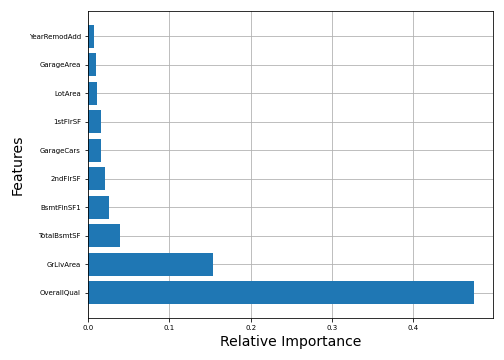

# Feature Importance with Random Forests

The depth of a feature in a decision tree node determines the importance of that feature when making predictions. This means features near the top of the tree contributes to making a target prediction for a larger proportion of input samples. The expected fraction of the samples, then, is the relative feature importance.

Random forest uses an ensemble of randomised decision trees which averages the prediction of individual classifiers, which in turn lowers target variance. Each tree is built using bootstrap (sampling from input with replacement) from training set. 

In the following feature importance bar chart, we have omitted features with a relative importance of 0. However, many features are shown to have a miniscule importance value, hence the absurd length of the chart. Still, we find that just as with decision trees, `OverallQual` is by far the most important feature. However, other important features have now become visible, such as `YearBuilt`. 

This random forest model has given us many features with slight differences between their relative importance values. To trust these marginal values, we need to be certain this model will be performant on test set. However, since we do not have access to the test set in this phase of our project, we can use the out-of-bag estimate score. This acts as an estimate of model accuracy on the test set. This model has an `oob_score = 86.5%` which isn't entirely a poor model.

It is known that the feature importances computed above is prone to place importance bias on features that are numerical or has high cardinality. Furthermore, feature importance values given for a model learned from a training set can be different from test set due to capacity to overfit.

To avoid these effects and for comparison, we use an alternate method of computing feature importance which is known as Permutation Importance.

As it appears in both of the figures above, permutation importance and random forest are in agreement. This is explained by the fact that we are performing a regression task, hence, the random forest feature importance is being measured by decrease in variance, not mean decrease in impurity, as is the case with classification problems. 

## Shapley Values

Lastly, we apply SHAP, a model interpreter whose foundations lie in game theory. By using Shapley values, we will explain how much each feature contributes to making a prediction as an indicator of its relative importance. 

As seen in the SHAP summary plot below, the relative feature importance is identical to ones obtained through other methods. Features with high SHAP push predicted `SalePrice` to a larger value and features with zero or negative values pull the target value down.

## Mutual Information (MI)

MI from information theory provides us with a metric for measuring the dependency between an input feature and the target. A higher value corresponds to more dependency and 0 means feature and target are independent. Our strategy here is to extract which features have `MI > 0` and show them in the following chart. 

We note that so far, our top 5 features are:

| Rank   | Feature           | 
| ------ |:-------------:|
| 1      | OverallQual |
| 2      | GrLivArea      | 
| 3      | TotalBsmtSF     |    
| 4      | BsmtFinSF1      | 
| 5      | 1stFlrSF      | 

however their relative importance ranking has been different for each technique.

---

Return to [Data Exploration](../readme.md).